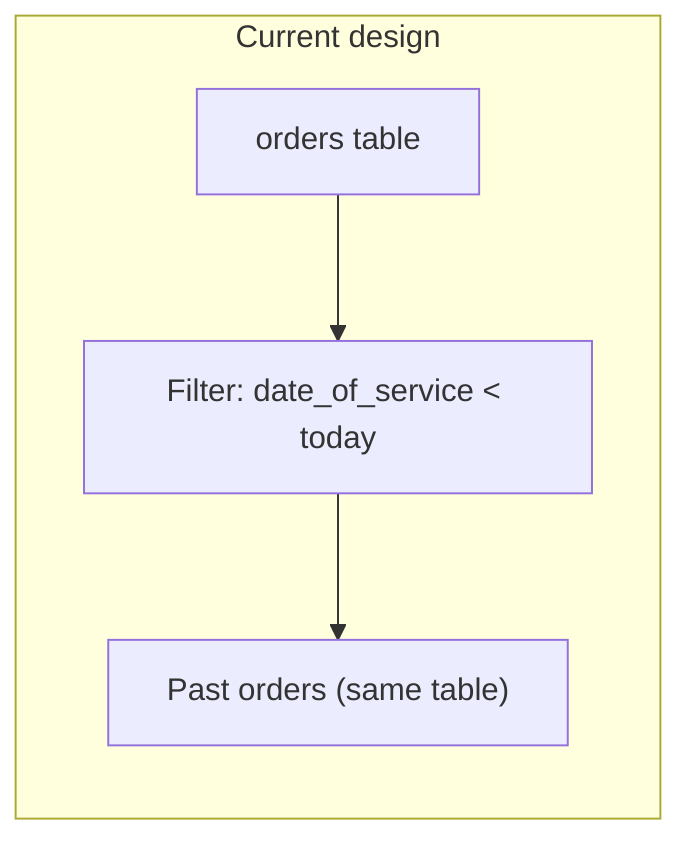
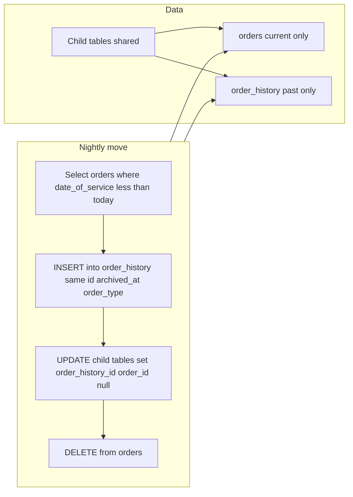

# Order History Backend – Code Review and Improvements Plan

## 1. Current State (What You Have)

### 1.1 Data model

- **Single table:** All orders live in `[orders](g:\Work\VaultWrx\VaultWrx-Backend-Service\src\api\models\Orders\Order.ts)` (entity `Order`, table `orders`). There is **no** `order_history` (or similar) table anywhere in the backend.
- **Relevant date:** Orders have `date_of_service` (date, nullable). “Past” is defined in code as **date_of_service < today** (start of day).
- **Child data:** Orders are linked to: `order_items`, `deceased`, `photos`, `order_extra_charges`, `order_contacts`, `comments`, `delivery_schedules` (all by `order_id`). These are not separated by “current” vs “history.”

### 1.2 How “order history” is implemented today

- **Filter only:** In [OrderRepository.getOrdersGroupedByDateAndProductType](g:\Work\VaultWrx\VaultWrx-Backend-Service\src\api\repositories\Orders\OrderRepository.ts) (lines 514–611), when `orderStatus === 'past'`:
  - Query: `date_of_service < :today` and `is_deleted = false` and `is_edited = false` on the **same** `orders` table.
  - No rows are moved or copied; “history” is just a filter on current orders.
- **API:** [OrderController.getGroupedByDateAndProductType](g:\Work\VaultWrx\VaultWrx-Backend-Service\src\api\controllers\Orders\OrderController.ts) (GET `/orders/grouped-by-date-and-product-type`) accepts `orderStatus`; frontend history page calls with `orderStatus: 'past'` and gets this filtered list.
- **Single-order read:** [getOneById](g:\Work\VaultWrx\VaultWrx-Backend-Service\src\api\repositories\Orders\OrderRepository.ts) reads from `orders` only; there is no lookup in a history store.

### 1.3 Performance and scale (current)

- **No pagination for “past” in grouped API:** For `orderStatus === 'past'`, the repository does `queryBuilder.getMany()` with **no** `skip`/`take`. All past orders are loaded, then grouped in memory (lines 644–696). With a large number of past orders this will not scale.
- **Heavy joins:** The same query uses 20+ `leftJoinAndSelect` (company, location, user, retailer, customer, director, staff, orderItems + product + paintColor + deliverySchedules, deceased, photos, orderExtraCharges, contacts, etc.). Every “past” request pulls a large graph for every past order.
- **No dedicated indexes:** The initial migration creates `orders` but does not add indexes on `date_of_service` or `(company_id, date_of_service)` in the reviewed snippet. Unindexed filters on a growing table will slow down as data grows.
- **Main list:** [getManyAndCount](g:\Work\VaultWrx\VaultWrx-Backend-Service\src\api\repositories\Orders\OrderRepository.ts) (lines 17–88) applies pagination only when `resourceOptions.pagination` is present (skip/take). If the frontend does not send pagination, the default list can return all orders (again, heavy joins).

---

## 2. Gaps vs. Your Requirements

| Requirement                             | Current                                                             | Gap                                                                                                                                                                                         |
| --------------------------------------- | ------------------------------------------------------------------- | ------------------------------------------------------------------------------------------------------------------------------------------------------------------------------------------- |
| Past orders moved out of `orders`       | No; all orders stay in `orders`                                     | Need a separate **order history** store and a process that **moves** (or copies then deletes) past orders into it.                                                                          |
| `orders` must not contain past orders   | Past orders are still in `orders`                                   | Need a scheduled (or event-driven) job that moves orders where `date_of_service < today` to history and removes them from `orders` (or marks them as archived and excludes from main list). |
| Order history table holds huge datasets | No history table                                                    | Need an **order_history** (and likely history child tables or a design that supports FKs) and schema/indexing for large, append-heavy read workload.                                        |
| Good performance / no slowdowns         | No pagination for past grouped API; heavy joins; no indexes on date | Need: pagination (or cursor) for history reads, indexes on date/company, optional partitioning, and lighter queries or read-optimized structures.                                           |

---

## 3. Improvements Plan

### 3.1 Define “past” consistently

- **Rule:** Order is **past** when `date_of_service` is strictly before **today** (start of day, server time or configured timezone).
- **Edge case:** Orders with `date_of_service IS NULL` should be defined (e.g. treat as “current” until set, or never move to history). Current “past” filter already requires `date_of_service IS NOT NULL` for other statuses; for move-to-history, same rule is recommended.

### 3.2 Option A: order_history table and shared child tables (repoint FKs)

**order_history table**

- Same columns as `orders` (see [Order](g:\Work\VaultWrx\VaultWrx-Backend-Service\src\api\models\Orders\Order.ts)) plus:
  - `archived_at` (timestamptz, set when row is inserted from move job).
  - `order_type` (varchar, nullable): primary product type for the order, used for UI tabs (Vaults, Precast, Caskets, Urns, Monuments, Cremations). Derive from order_items (e.g. first item’s `productType` or majority); values align with `ProductType` enum (vault, casket, urn, grave_digging, cremation, monument, bulk_precast).
- Primary key: `id` (uuid, same as original `orders.id`) so the same identifier can be used after move.
- **Idempotency key:** Use `order_history.id` as the idempotency key for the move operation. Enforce a **UNIQUE constraint** on `order_history.id` so the same order cannot be inserted twice. The cron (or any caller) must check “id not in (select id from order_history)” before inserting, or use INSERT … ON CONFLICT (id) DO NOTHING / skip on unique violation. This keeps the job safe to re-run and avoids duplicate history rows.

**One set of child tables (repoint, no duplicate history child tables)**

- Child tables that currently reference `orders` via `order_id`: `order_items`, `deceased`, `photos`, `order_extra_charges`, `order_contacts`, `comments`. (`delivery_schedules` references `order_items` only.)
- Change: add nullable `order_history_id` (uuid, FK to `order_history.id`) on each of these. Keep existing `order_id` (FK to `orders`).
- Invariant: for each row, exactly one of `order_id` or `order_history_id` is set (current vs archived).
- **Move process:** For each order to archive: (1) INSERT into `order_history` (same `id`, set `archived_at`, set `order_type` from order_items). (2) UPDATE all child rows for that order: SET `order_history_id = order_id`, `order_id = NULL`. (3) DELETE from `orders` where `id = :id`. Use a transaction per order (or per batch of N orders) so repoint + delete are atomic.

### 3.3 Indexes

- **orders:** `(company_id, date_of_service)`, optionally `date_of_service`.
- **order_history:** `(company_id, date_of_service)`, `(company_id, archived_at)`, `(company_id, order_type, date_of_service)` for tab + date filtering. Add `date_of_service`, `archived_at` if needed for partition pruning.

### 3.4 Partitioning order_history

- **By time:** Partition by **RANGE** on `date_of_service` (or `archived_at`) by **month** (or year) so that queries and the nightly job can prune to recent partitions. Create partitions ahead (e.g. next 12 months) or via a maintenance job.
- **By order_type (tabs):** Add **LIST** partitioning on `order_type`, or a single table with a strong **index** on `(company_id, order_type, date_of_service)`. PostgreSQL allows one partitioning key; recommended: **RANGE (date_of_service)** by month, and rely on index `(company_id, order_type, date_of_service)` for the “tab + list” UI (Vaults, Precast, Caskets, etc.). If you need list partitioning by `order_type`, use composite partitioning (e.g. list by order_type, then range by date within each) if the ORM and migrations support it; otherwise range-by-date + index on order_type is sufficient for performance.

### 3.5 Order history endpoints and layer

- **OrderHistory entity:** New entity mapping to `order_history` (same fields as Order plus `archived_at`, `order_type`). Register in [entities](g:\Work\VaultWrx\VaultWrx-Backend-Service\src\config\entities.ts).
- **OrderHistoryRepository:** Methods: getManyAndCount (paginated, filter by company_id, optional order_type, date range); getOrdersGroupedByDateAndProductType (paginated, by company_id, order_type); getOneById(id, companyId). Use joins to shared child tables via `order_history_id`. Enforce max page size (e.g. 100) and cursor or offset pagination.
- **OrderHistoryService:** Wraps repository; applies company/auth checks; returns DTOs.
- **OrderHistoryController:** New controller (e.g. under `/orders/history` or `/order-history`):
  - GET `/orders/history` – list history orders (paginated, optional order_type, date range).
  - GET `/orders/history/grouped-by-date-and-product-type` – grouped view for history (paginated), supporting the same tab/product-type UX as the image.
  - GET `/orders/history/:id` – get one history order by id (with relations via order_history_id).
- **Main OrderService.getOne(id):** Resolve from `orders` first; if not found, call OrderHistoryService.getOneById(id) so links to past orders still work. Single contract for “get order by id” for both current and history.

### 3.6 Main “orders” APIs (current only)

- **getManyAndCount** and **getOrdersGroupedByDateAndProductType** (when not history): Always filter to current orders only: `(date_of_service >= :today OR date_of_service IS NULL)` so the `orders` table conceptually holds only active/today+ orders once the cron has moved past orders.

### 3.7 Nightly cron job (copy then delete)

- **Where:** New job in existing [cron-jobs](g:\Work\VaultWrx\VaultWrx-Backend-Service\src\api\cron-jobs) folder, following [ExampleCronJob](g:\Work\VaultWrx\VaultWrx-Backend-Service\src\api\cron-jobs\Common\ExampleCronJob.ts) (CronController + Cron decorator, Service).
- **Schedule:** Nightly during low traffic, e.g. `0 2 * * *` (2 AM) – use cron expression supported by `cron-decorators`.
- **Logic:** (1) Select orders where `date_of_service < CURRENT_DATE` and `is_deleted = false` and not already in `order_history` (id not in (select id from order_history)), in batches (e.g. 500). (2) For each batch, in a transaction: INSERT into `order_history` (same columns + archived_at, order_type), UPDATE child tables SET order_history_id = order_id, order_id = NULL for those order ids, DELETE from orders where id in (:ids). (3) **Idempotency key:** Treat `order_history.id` as the idempotency key. Only insert if the order id is not already in `order_history`; rely on the UNIQUE constraint on `order_history.id` so re-runs or retries never create duplicate history rows.
- **Config:** Cron loaded from `appConfig.cronJobsDir`; ensure `ENABLE_CRON_JOBS` is true where the job should run.

### 3.8 Migrations

- Migration 1: Create `order_history` (all order columns + `archived_at`, `order_type`); **UNIQUE constraint on `id`** (idempotency key); create indexes; create range partitions by month on `date_of_service` (or create table as partition parent and first partitions).
- Migration 2: Add `order_history_id` to `order_items`, `deceased`, `photos`, `order_extra_charges`, `order_contacts`, `comments` (nullable, FK to order_history); add constraint that exactly one of `order_id` or `order_history_id` is non-null (check constraint).
- Migration 3 (optional): Add indexes on `orders` for `(company_id, date_of_service)` if not present.

### 3.9 Move flow (nightly cron)

---

## 4. Implementation summary (Option A)

- **order_history table:** Same columns as `orders` plus `archived_at`, `order_type` (for tabs: Vaults, Precast, Caskets, Urns, Monuments, Cremations). PK and **idempotency key:** `id` (same UUID as original order), with UNIQUE on `id` so the move job is safe to re-run.
- **Shared child tables:** One set of child tables; add `order_history_id` (FK to order_history). Move = INSERT into order_history, UPDATE children to set order_history_id = order_id and order_id = NULL, DELETE from orders.
- **History layer:** OrderHistory entity, OrderHistoryRepository, OrderHistoryService, OrderHistoryController with GET list (paginated), GET grouped-by-date-and-product-type (paginated), GET /:id. Main OrderService.getOne(id) resolves from orders then order_history.
- **Indexes:** orders and order_history indexed on (company_id, date_of_service), (company_id, order_type, date_of_service); order_history on (company_id, archived_at).
- **Partitioning:** order_history partitioned by RANGE on date_of_service (monthly or yearly); tab filtering via index on order_type.
- **Cron:** Nightly job (e.g. 2 AM) in existing cron-jobs folder: batch select past orders, copy to order_history + repoint child FKs + delete from orders, in transactions.
- **Main orders APIs:** Filter to current only (date_of_service >= today OR date_of_service IS NULL).

---

## 5. Agent todo list (execution order – no shortcuts, no dummy data)

Execute in this order. Each item must be fully implemented; no placeholder or dummy data.

1. **Migration 1a:** Create `order_history` table with every column from `orders` (match Order entity 1:1), plus `archived_at` (timestamptz), `order_type` (varchar). Primary key `id` (uuid). UNIQUE constraint on `id` (idempotency key).
2. **Migration 1b:** Add indexes on `order_history`: `(company_id, date_of_service)`, `(company_id, archived_at)`, `(company_id, order_type, date_of_service)`.
3. **Migration 1c:** Create `order_history` as RANGE partition parent on `date_of_service`; create initial monthly (or yearly) partitions for current and next 12 months.
4. **Migration 2a:** Add column `order_history_id` (uuid, nullable, FK → `order_history.id`) to: `order_items`, `deceased`, `photos`, `order_extra_charges`, `order_contacts`, `comments`. Keep existing `order_id` (FK → `orders`).
5. **Migration 2b:** Add CHECK constraint on each of those six tables: exactly one of `order_id` or `order_history_id` is NOT NULL.
6. **Migration 3:** Add indexes on `orders`: `(company_id, date_of_service)` and optionally `date_of_service` if not present.
7. **OrderHistory entity:** New entity mirroring Order plus `archived_at`, `order_type`. Register in `config/entities.ts`.
8. **OrderHistoryRepository:** Implement getManyAndCount (paginated, companyId, order_type/date filters, max page 100), getOrdersGroupedByDateAndProductType (paginated, companyId, order_type), getOneById(id, companyId). Joins to child tables via `order_history_id`. Real SQL/TypeORM only.
9. **OrderHistoryService:** Implement service methods wrapping repository; company/auth; pagination (max 100); return real DTOs.
10. **OrderHistoryController:** Implement GET `/orders/history`, GET `/orders/history/grouped-by-date-and-product-type`, GET `/orders/history/:id` with auth and company header checks. Real responses only.
11. **OrderService.getOne:** Update to try `orders` first, then `order_history`; single contract for GET `/orders/:id` for current and history.
12. **Main orders filter:** Update OrderRepository getManyAndCount and getOrdersGroupedByDateAndProductType to filter current only: `(date_of_service >= :today OR date_of_service IS NULL)`.
13. **OrderHistoryArchiveCronJob:** New cron class in `api/cron-jobs`, schedule `0 2` * * * (2 AM). Inject DataSource and repos.
14. **Cron job logic:** Select past orders (date_of_service < today, is_deleted = false, id not in order_history), batch 500. Per batch in transaction: INSERT into order_history (all order columns + archived_at, order_type derived from order_items), UPDATE child tables (order_history_id = order_id, order_id = NULL), DELETE from orders. Enforce idempotency via order_history.id. Derive order_type from first or majority order_item productType.
15. **Verify:** No dummy data, no stub returns, no TODO placeholders in production code paths.

