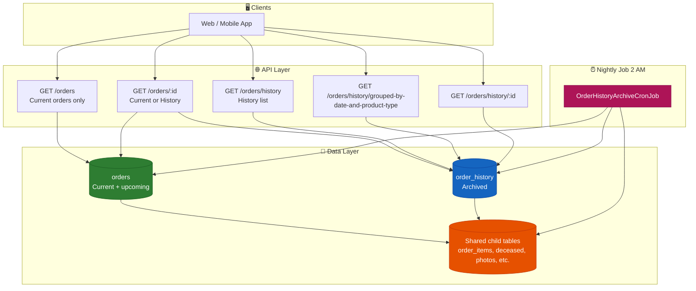
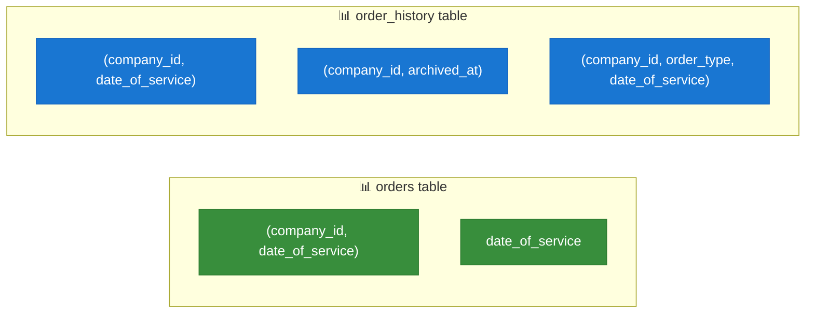
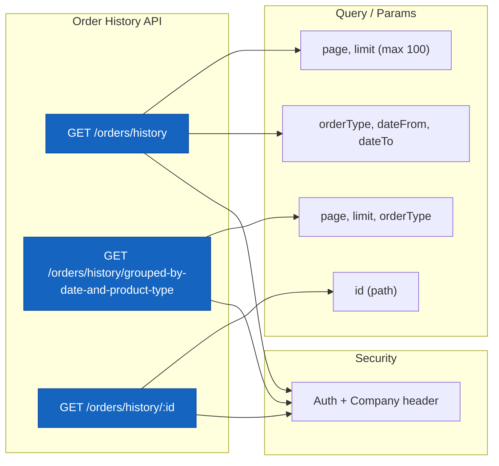
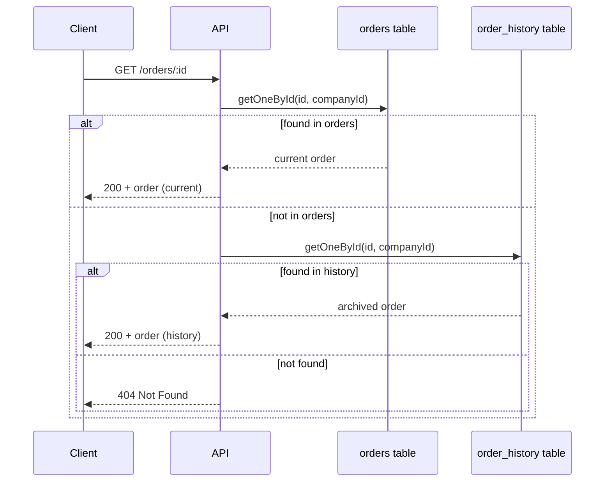
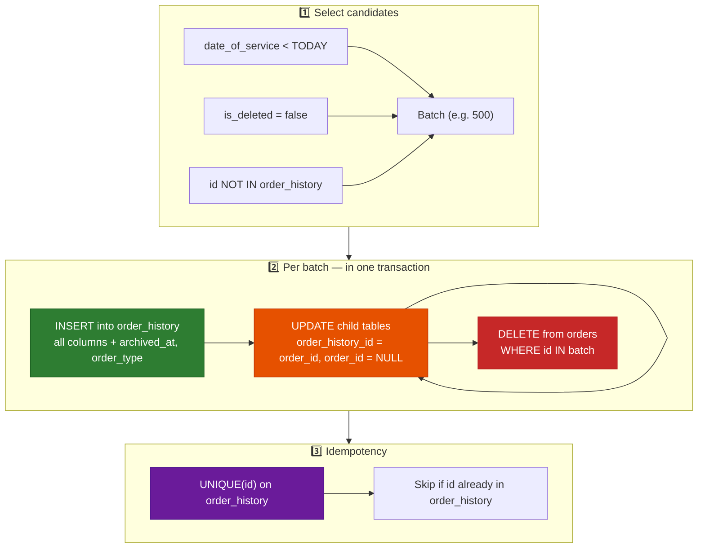
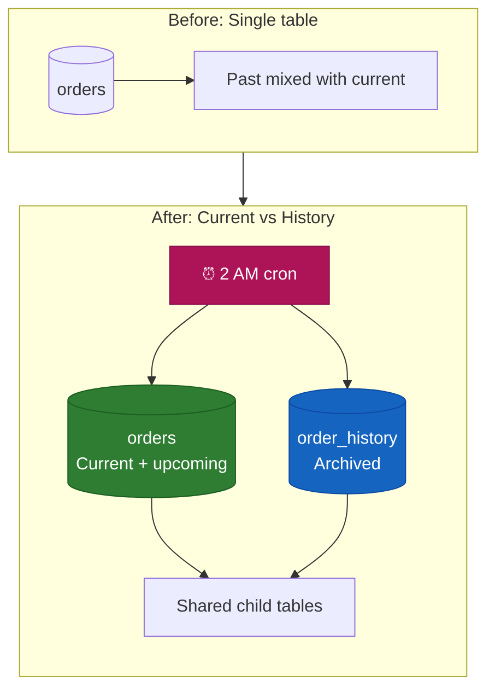

# Order History — Implementation Summary for Clients

**VaultWrx Backend · Order History Feature**  
*Performance, scale, and workflow documentation*

---

## 1. Overview

Order History is a backend feature that **moves completed (past) orders** out of the main orders table into a dedicated **order_history** store. This keeps the main orders list fast and focused on **current and upcoming** work, while **past orders** remain fully accessible for reporting and lookup via dedicated history APIs and a **single order-by-ID** contract.


| Goal                              | How we solved it                                                                                                             |
| --------------------------------- | ---------------------------------------------------------------------------------------------------------------------------- |
| **Past orders out of main table** | Nightly job moves orders with `date_of_service < today` into `order_history` and removes them from `orders`.                 |
| **Performance & scale**           | Pagination (max 100 per page), targeted indexes, and a separate history table so main list and history queries stay fast.    |
| **Single “get order by ID”**      | `GET /orders/:id` checks **orders** first, then **order_history**, so one URL works for current and archived orders.         |
| **Safe, repeatable move**         | Idempotent cron: same order is never inserted twice into history; batch size is configurable via `BATCH_SIZE_ORDER_HISTORY`. |


---

## 2. High-Level Architecture




**Summary:** Clients call the same APIs; current data lives in **orders**, archived data in **order_history**. Child data (items, deceased, photos, etc.) is **shared** and pointed either to `orders` or `order_history` via `order_id` or `order_history_id`. A nightly cron moves past orders from **orders** into **order_history** and repoints those children.

---

## 3. Performance & Scale

### 3.1 What We Improved


| Area                   | Before                                                               | After                                                                                                                                                                                   |
| ---------------------- | -------------------------------------------------------------------- | --------------------------------------------------------------------------------------------------------------------------------------------------------------------------------------- |
| **Main orders list**   | Could return all orders; no date filter                              | Only **current** orders: `date_of_service >= today` or `date_of_service IS NULL`; pagination supported.                                                                                 |
| **History list**       | No dedicated store; “past” was a filter on same table; no pagination | Dedicated **order_history** table; **paginated** list and grouped API (max 100 per page).                                                                                               |
| **Indexes**            | No dedicated indexes on date/company                                 | Indexes on **orders** and **order_history** for `(company_id, date_of_service)`, and on **order_history** for `(company_id, archived_at)`, `(company_id, order_type, date_of_service)`. |
| **Single order by ID** | Only from `orders`                                                   | **Unified lookup:** try `orders` first, then `order_history`, so one ID works for both.                                                                                                 |


### 3.2 Index Strategy




- **orders:** Optimized for “current orders” by company and date.  
- **order_history:** Optimized for history list, archive time, and **product-type tabs** (Vaults, Caskets, Urns, etc.).

### 3.3 Pagination & Bounded Queries

- **History list:** `GET /orders/history` — paginated with `page` and `limit` (max **100** per page).  
- **Grouped history:** `GET /orders/history/grouped-by-date-and-product-type` — paginated (max **100**), no unbounded “load all” for history.  
- **Main orders:** List and grouped APIs for current orders also respect pagination and the current-only filter.

---

## 4. Data Model & Shared Child Tables

We use **one set of child tables** for both current and archived orders. Rows point to either **orders** or **order_history**, not both.

### 4.1 Tables Involved

```mermaid
erDiagram
    orders ||--o{ order_items : "order_id"
    orders ||--o{ deceased : "order_id"
    orders ||--o{ photos : "order_id"
    orders ||--o{ order_extra_charges : "order_id"
    orders ||--o{ order_contacts : "order_id"
    orders ||--o{ comments : "order_id"

    order_history ||--o{ order_items : "order_history_id"
    order_history ||--o{ deceased : "order_history_id"
    order_history ||--o{ photos : "order_history_id"
    order_history ||--o{ order_extra_charges : "order_history_id"
    order_history ||--o{ order_contacts : "order_history_id"
    order_history ||--o{ comments : "order_history_id"

    orders {
        uuid id PK
        date date_of_service
        ... all order columns
    }

    order_history {
        uuid id PK "same as original order"
        timestamptz archived_at
        varchar order_type "vault, casket, urn, etc."
        ... same columns as orders
    }

    order_items {
        uuid order_id "nullable, FK orders"
        uuid order_history_id "nullable, FK order_history"
        "CHECK: exactly one of order_id, order_history_id"
    }
```


- **orders:** Holds only **current / upcoming** orders (after the nightly move).  
- **order_history:** Same columns as orders, plus `archived_at` and `order_type` (derived from order items). Same `id` as the original order for stable references.  
- **Child tables** (order_items, deceased, photos, order_extra_charges, order_contacts, comments): Each row has **either** `order_id` **or** `order_history_id` set (enforced by a CHECK constraint).

### 4.2 Move Process (Conceptual)

When an order is moved:

1. **INSERT** into `order_history` (same `id`, all order columns + `archived_at`, `order_type`).
2. **UPDATE** child rows: set `order_history_id = order_id`, `order_id = NULL` for that order.
3. **DELETE** the row from `orders`.

All of this is done **per batch in a single transaction** so the move is atomic and repeatable (idempotent).

---

## 5. Order History API Layer


Dedicated endpoints under `**/orders/history`** with auth and company checks. All return **real data** from `order_history` (no stubs or dummy data).

### 5.1 Endpoints Overview




| Method  | Path                                               | Purpose                                                                                                                                         |
| ------- | -------------------------------------------------- | ----------------------------------------------------------------------------------------------------------------------------------------------- |
| **GET** | `/orders/history`                                  | Paginated list of archived orders. Optional filters: `orderType`, `dateFrom`, `dateTo`. Max page size 100.                                      |
| **GET** | `/orders/history/grouped-by-date-and-product-type` | Same as above but **grouped by date** and then by **product type** (tabs: Vaults, Caskets, Urns, etc.). Paginated; optional `orderType` filter. |
| **GET** | `/orders/history/:id`                              | Single archived order by ID with full relations (items, deceased, photos, charges, contacts, comments).                                         |


- **Auth:** All require authentication and the **company-id** (or **x-company-id**) header; users only see history for their company.  
- **Pagination:** List and grouped endpoints use `page` and `limit`; server enforces a maximum of **100** per page.

### 5.2 Unified Order Lookup




- **Single contract:** `GET /orders/:id` works for both **current** and **archived** orders.  
- Implementation: try **orders** first; if not found, try **order_history**; return 404 only if neither has the id for that company.

---

## 6. Nightly Cron Job (Archive Workflow)

A scheduled job runs **every night at 2:00 AM** to move past orders from **orders** to **order_history** and repoint child rows.

### 6.1 Schedule & Configuration


| Setting            | Value                    | Notes                                                              |
| ------------------ | ------------------------ | ------------------------------------------------------------------ |
| **Schedule**       | `0 2 * * *` (2 AM daily) | Cron expression; low-traffic window.                               |
| **Batch size**     | Configurable             | Env var `**BATCH_SIZE_ORDER_HISTORY`** (default 500).              |
| **Enable/disable** | `**ENABLE_CRON_JOBS`**   | Must be `true` where the job should run.                           |
| **Job discovery**  | `**CRON_JOBS_DIR`**      | Directory/glob that includes the job class (e.g. `*Job{.ts,.js}`). |


### 6.2 Nightly Move Flow




### 6.3 Order Type Derivation

- **order_type** in `order_history` is set from the order’s **order items**:  
  - **First** item’s `productType` if it’s a valid ProductType, **or**  
  - **Majority** productType among items (vault, casket, urn, grave_digging, cremation, monument, bulk_precast).
- Used for **tabs/filters** in the history UI (e.g. “Vaults”, “Caskets”).  
- Null only when the order has no items.

### 6.4 Safety & Idempotency

- **Idempotency:** Each order is identified by the same `id` in both tables. We only insert into `order_history` if that `id` is not already there; **UNIQUE(id)** on `order_history` prevents duplicates.  
- **Transactions:** Each batch is run in a **single transaction**: insert history rows, update all child tables, delete from orders. On failure, the batch is rolled back.  
- **Re-runs:** If the job is run again (e.g. retry or manual run), already-archived orders are skipped; no duplicate history rows and no double-delete from orders.

---

## 7. Implementation Summary Table


| #   | Component                      | Implementation                                                                                                                                                                                                                        |
| --- | ------------------------------ | ------------------------------------------------------------------------------------------------------------------------------------------------------------------------------------------------------------------------------------- |
| 1   | **order_history table**        | Same columns as **orders** plus `archived_at` (timestamptz), `order_type` (varchar). PK and UNIQUE on `id`.                                                                                                                           |
| 2   | **Indexes on order_history**   | `(company_id, date_of_service)`, `(company_id, archived_at)`, `(company_id, order_type, date_of_service)`.                                                                                                                            |
| 3   | **Child tables**               | Added nullable **order_history_id** (FK to order_history) to: order_items, deceased, photos, order_extra_charges, order_contacts, comments. Kept **order_id** (FK to orders).                                                         |
| 4   | **CHECK constraints**          | On each of the six child tables: exactly one of **order_id** or **order_history_id** is NOT NULL.                                                                                                                                     |
| 5   | **Indexes on orders**          | `(company_id, date_of_service)` and `date_of_service` (if not already present).                                                                                                                                                       |
| 6   | **OrderHistory entity**        | Mirrors Order plus `archived_at`, `order_type`; registered in config.                                                                                                                                                                 |
| 7   | **OrderHistoryRepository**     | getManyAndCount (paginated, filters, max 100), getOrdersGroupedByDateAndProductType (paginated, order_type), getOneById(id, companyId). Joins children via **order_history_id**.                                                      |
| 8   | **OrderHistoryService**        | Wraps repository; company/auth; pagination (max 100); returns real DTOs.                                                                                                                                                              |
| 9   | **OrderHistoryController**     | GET `/orders/history`, GET `/orders/history/grouped-by-date-and-product-type`, GET `/orders/history/:id`; auth and company header checks.                                                                                             |
| 10  | **OrderService.getOne**        | Tries **orders** first, then **order_history**; single contract for GET `/orders/:id`.                                                                                                                                                |
| 11  | **Main orders filter**         | getManyAndCount and getOrdersGroupedByDateAndProductType (current only): `date_of_service >= today OR date_of_service IS NULL`.                                                                                                       |
| 12  | **OrderHistoryArchiveCronJob** | Schedule `0 2 * * `* (2 AM); uses DB connection and repositories; batch size from **BATCH_SIZE_ORDER_HISTORY**.                                                                                                                       |
| 13  | **Cron logic**                 | Select past orders (date < today, not deleted, not already in order_history), batch; per batch in transaction: INSERT order_history, UPDATE children, DELETE orders; idempotent; **order_type** from order items (first or majority). |


---

## 8. Diagram Summary




**In short:** We split “current” and “past” into **orders** and **order_history**, kept one set of child tables with a clear rule (either `order_id` or `order_history_id`), added indexes and pagination for performance, exposed history through dedicated APIs and a unified GET-by-ID, and automated the move with a safe, idempotent nightly job.

---

*Document version: 1.0 · VaultWrx Backend — Order History Implementation*